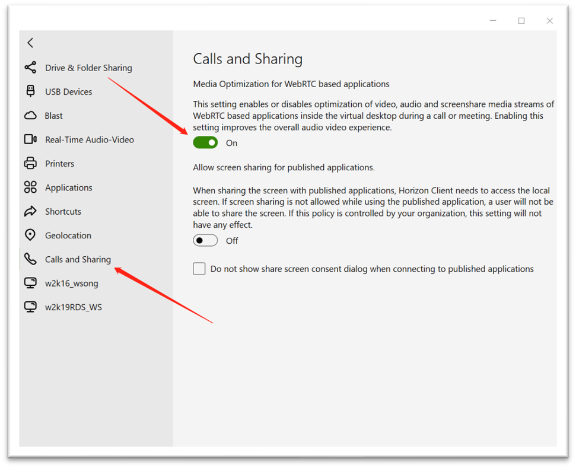

The Horizon WebRTC Redirection option is installed and enabled in Horizon Client for Windows by default.

The user can turn off this option from the Horizon Client settings as shown in the following screenshot.

## To verify that Horizon WebRTC Redirection is enabled on the Windows client endpoint:
1. On the Windows client, go to:  
   `C:\Program Files\Omnissa\Omnissa Horizon Client\`
2. Confirm the presence of `webrtc_sharedlib.dll` in the folder.
