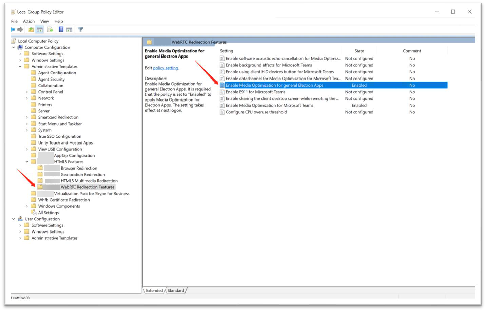
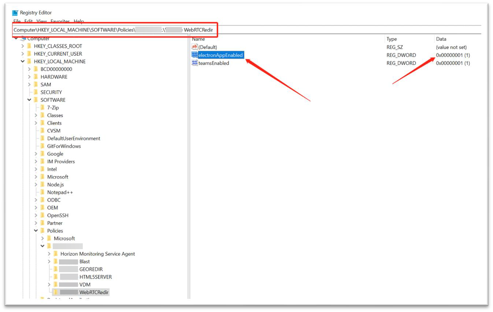

The Horizon WebRTC Redirection feature is installed by default with Horizon Agent as part of the core feature set.

However, the feature is installed in deactivated state. You must manually activate or enable the feature using the Group Policy Management Editor (GPO editor).

### To enable WebRTC Redirection on the agent machine using the GPO editor:

1. Download latest GPO bundle: 
   - Go to [Omnissa Customer Connect Downloads](https://customerconnect.omnissa.com/downloads/#products_atoz) 
   - Select **Horizon** and click **GO TO DOWNLOADS**. 
   - Find **GPO Bundle** and click **DOWNLOAD NOW**:   
     `-Horizon-Extras-Bundle-YYMM-x.x.x-yyyyyyyy.zip` where YYMM is the marketing version, x.x.x is the internal version and yyyyyyyy is the build number.

2. Set up the Windows GPO policy to include Horizon ADMX template files.

3. Using the GPO editor, navigate to   
   `Computer Configuration > Administrative Templates > View Agent Configuration > HTML5 Features > WebRTC Redirection Features`

4. Set **Enable Media Optimization for general Electron Apps** policy to the state of **Enabled**

5. To make the group policy change take effect, log out from the agent machine and then log back in.

1

### To verify that WebRTC Redirection GPO policy is enabled on the agent machine:

1. Go to:  
  `HKEY_LOCAL_MACHINE\SOFTWARE\Policies\Omnissa\Horizon\WebRTCRedir`
2. Verify that the **electronAppEnabled** registry key is present in that folder.

