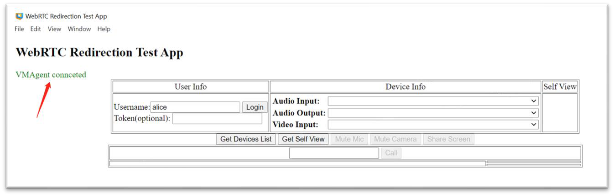
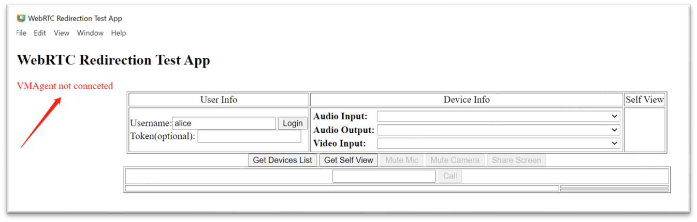

## Verify the WebRTC Redirection Sample Application

As the final step of the Horizon WebRTC Redirection setup, verify that the WebRTC Redirection sample application is correctly configured.

The sample application is included with the Horizon SDK for WebRTC Redirection.

For detailed information, see: 
- **"Setting Up the Sample Application"** in the *Omnissa Horizon SDK for WebRTC Redirection Programming Guide* 
- Instructions in `webrtcredir\sample\README.txt` in the SDK zip file

### To verify the test application setup:

1. **Launch** the WebRTC Redirection test application.
2. **Wait a few seconds** for the application to establish a connection to the agent machine.
3. Verify that a **green label** appears indicating **connected status**.

In connected status, the application can successfully call the Horizon WebRTC Redirection APIs, redirecting media streams to the client endpoint.

**Example: Connected Status**

---

If you see a **red "Not Connected"** label after launching the app, WebRTC Redirection was **not correctly enabled**.

In this status, the application falls back to calling the built-in Electron WebRTC APIs, which redirect WebRTC-based media streams using the non-optimized Real-Time Audio-Video feature. For more information, see the [System Requirements for Real-Time Audio-Video](https://docs.omnissa.com/bundle/Horizon-Remote-Desktop-FeaturesV2206/page/SystemRequirementsforReal-TimeAudio-Video.html). 

**Example: Not Connected Status**

