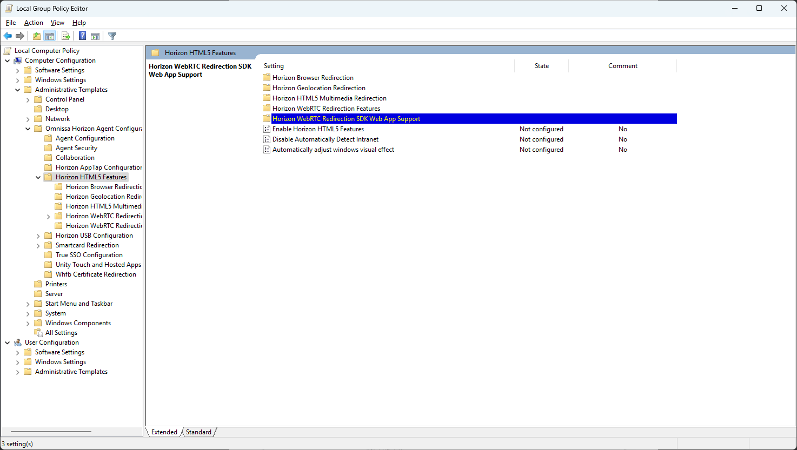
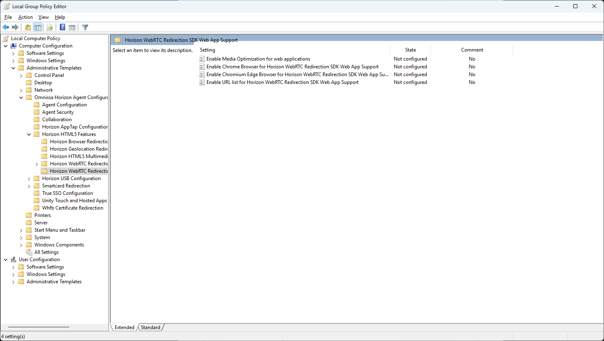
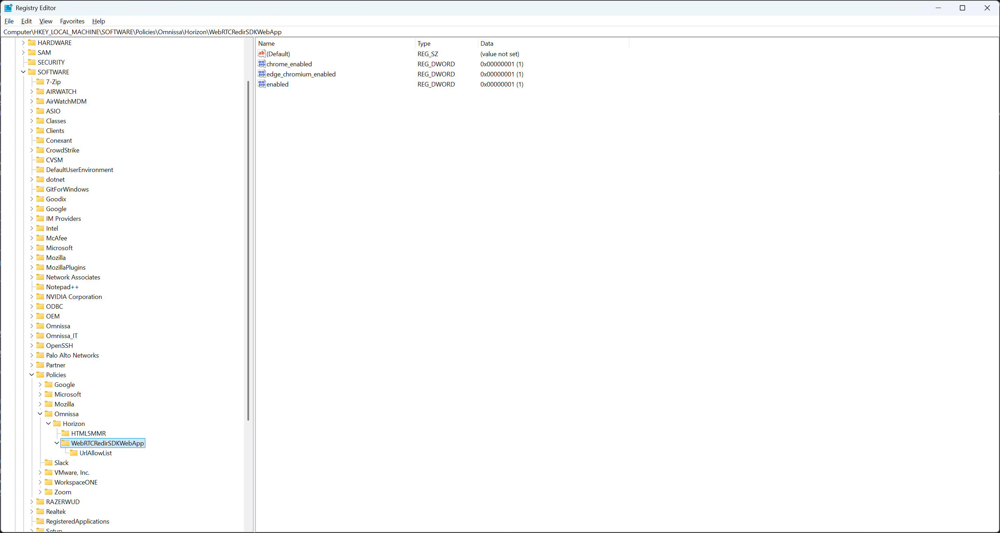

The Horizon browser-based WebRTC Redirection feature is installed by default with Horizon Agent as part of the core feature set.

However, the feature is installed in deactivated state. You must manually activate or enable the feature using the Group Policy Management Editor (GPO editor).

## Setup browser-based Webrtc Redirection for web application on agent

### To enable Horizon WebRTC Redirection SDK Web App Support on the agent machine using the GPO editor:

1. Download latest GPO bundle: 
   - Go to [Omnissa Customer Connect Downloads](https://customerconnect.omnissa.com/downloads/#products_atoz) 
   - Select **Horizon** and click **GO TO DOWNLOADS**. 
   - Find **GPO Bundle** and click **DOWNLOAD NOW**:   
     `-Horizon-Extras-Bundle-YYMM-x.x.x-yyyyyyyy.zip` where YYMM is the marketing version, x.x.x is the internal version and yyyyyyyy is the build number.

2. Set up the Windows GPO policy to include Horizon ADMX template files. Using the GPO editor, navigate to   
   `Computer Configuration > Administrative Templates > Omnissa Horizon Agent Configuration > Horizon HTML5 Features > Horizon WebRTC Redirection SDK Web App Support`

4. Set **Enable Media Optimization for web applications** policy to the state of **Enabled**

5. Set the policy to enable the Chrome/Edge browser.
   - To enable the Chrome browser, set **Enable Chrome Browser for Horizon WebRTC Redirection SDK Web App Support** policy to the state of **Enabled**

   - To enable the Edge browser, Set **Enable Chromium Edge Browser for Horizon WebRTC Redirection SDK Web App Support** policy to the state of **Enabled**

6. Set **Enable URL list for Horizon WebRTC Redirection SDK Web App Support** policy. E.g https://*.mycompany.com/*

7. To make the group policy change take effect, log out from the agent machine and then log back in.

### To verify that WebRTC Redirection GPO policy is enabled on the agent machine:

1. Go to:
  `HKEY_LOCAL_MACHINE\SOFTWARE\Policies\Omnissa\Horizon\WebRTCRedirSDKWebApp`
2. Verify that the **enabled**, **chrome_enabled**(or **edge_chromium_enabled**) registry key is present in that folder.
3. Verify that `HKEY_LOCAL_MACHINE\SOFTWARE\Policies\Omnissa\Horizon\WebRTCRedirSDKWebApp\UrlAllowList` registry key is present and has the URL list specified.

### Omnissa browser Extension
   - Horizon browser extension enables webapp support for the WebRTC SDK inside Horizon Agent and 
can be downloaded from the [Chrome Store](https://chromewebstore.google.com/detail/horizon-webrtc-web-app-su/emildoafpcgihdmhphelfhghioccllfi)
   - The extension is designed to be used by both Chrome and Edge browser.
