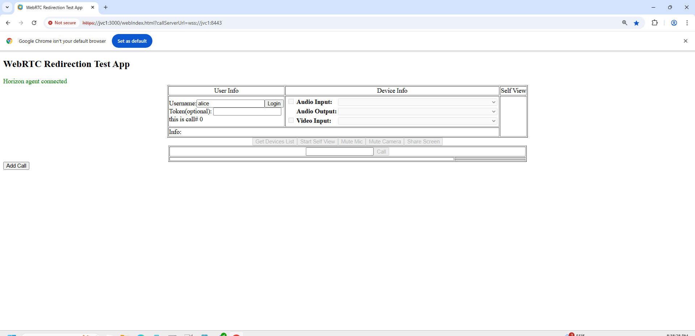
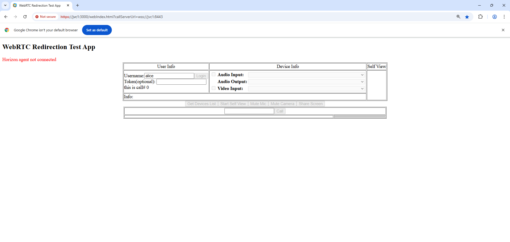

# Verify the browser-based WebRTC Redirection Sample Application

As the final step of the Horizon WebRTC Redirection for web app setup, verify that the WebRTC Redirection sample web application is correctly configured.

The sample web application is included with the Horizon SDK for WebRTC Redirection.

For detailed information, see: 
- **"Setting Up the Sample Application"** in the *Omnissa Horizon SDK for WebRTC Redirection Programming Guide* 
- Instructions in `sample\README.txt` in the SDK zip file

## To verify the test application setup:

1. **Launch** Chrome browser and nagivate to the WebRTC Redirection sample web application URL.
2. **Wait a few seconds** for the application to establish a connection to the agent machine.
3. Verify that a **green label** appears indicating **connected status**.

In connected status, the application can successfully call the Horizon WebRTC Redirection APIs, redirecting media streams to the client endpoint.

**Example: Connected Status**

---

If you see a **red "Not Connected"** label after launching the sample web application, WebRTC Redirection was **not correctly enabled**.

**Example: Not Connected Status**

